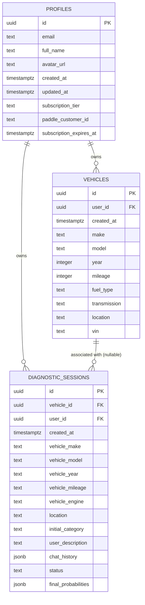

# Database Schema

## Tables

### 1. profiles
Linked to Supabase auth.users.
| Column | Type | Description |
|--------|------|-------------|
| id | uuid (PK) | Same as auth.users.id |
| email | text | User's email |
| full_name | text | Display name |
| avatar_url | text | Profile picture URL |
| created_at | timestamptz | Account creation time |
| updated_at | timestamptz | Last profile update |
| subscription_tier | text | 'Trial', 'Plus', or 'Pro' |
| paddle_customer_id | text | Paddle's customer identifier |
| subscription_expires_at | timestamptz | When subscription billing period ends |

### 2. vehicles
| Column | Type | Description |
|--------|------|-------------|
| id | uuid (PK) | Vehicle ID |
| created_at | timestamptz | When vehicle was added |
| user_id | uuid (FK → profiles.id) | Owner of the vehicle |
| make | text | e.g. 'Toyota' |
| model | text | e.g. 'Camry' |
| year | integer | e.g. 2020 |
| mileage | integer | Odometer reading in km |
| fuel_type | text | 'Petrol', 'Diesel', 'Hybrid', 'Electric' |
| transmission | text | 'Automatic', 'Manual' |
| location | text | User's country/city |
| vin | text | Vehicle Identification Number (optional) |

### 3. diagnostic_sessions
| Column | Type | Description |
|--------|------|-------------|
| id | uuid (PK) | Session ID |
| created_at | timestamptz | When session started |
| vehicle_id | uuid (FK → vehicles.id, nullable) | Associated vehicle (null if vehicle deleted) |
| user_id | uuid (FK → profiles.id) | Session owner |
| vehicle_make | text | Denormalized vehicle make (preserved even if vehicle deleted) |
| vehicle_model | text | Denormalized vehicle model |
| vehicle_year | text | Denormalized year |
| vehicle_mileage | text | Denormalized mileage |
| vehicle_engine | text | Fuel type at time of diagnosis |
| location | text | User's location at diagnosis time |
| initial_category | text | Problem category selected (e.g. 'Engine overheating') |
| user_description | text | User's free-text symptom description |
| chat_history | jsonb | Full array of {role, content} chat messages |
| status | text | 'investigating' or 'diagnosis_complete' |
| final_probabilities | jsonb | Array of {cause, confidence_score, reasoning, estimated_cost} |

### 4. plan_limits
| Column | Type | Description |
|--------|------|-------------|
| plan_name | text (PK) | 'Plus' or 'Pro' |
| max_sessions_per_day | integer | Daily session limit for this plan |

*Sample data: Plus = 5, Pro = unlimited (stored as high number or null)*

### 5. user_daily_usage
Appears to be a view or computed table.
| Column | Type | Description |
|--------|------|-------------|
| user_id | uuid | User reference |
| email | text | User's email |
| subscription_tier | text | Current tier |
| free_sessions_used_today | integer | Count of free sessions used in last 24h |
| paid_sessions_used_today | integer | Count of paid sessions used in last 24h |
| sessions_remaining_today | integer | Remaining sessions for today |

## Key Relationships
- profiles.id ← vehicles.user_id (one-to-many: user has many vehicles)
- profiles.id ← diagnostic_sessions.user_id (one-to-many: user has many sessions)
- vehicles.id ← diagnostic_sessions.vehicle_id (one-to-many: vehicle has many sessions, nullable)

## Important Notes
- When a vehicle is deleted, `diagnostic_sessions.vehicle_id` is set to NULL (not cascade deleted). This prevents users from bypassing session limits by deleting vehicles.
- Vehicle details are denormalized into `diagnostic_sessions` so history is preserved even if the vehicle is deleted.
- `subscription_tier` in profiles is ONLY updated by the Paddle webhook edge function. The client never writes this value directly.
- If `subscription_expires_at` is in the past, the tier is treated as 'Trial' regardless of the stored value.

## Entity Relationship Diagram

